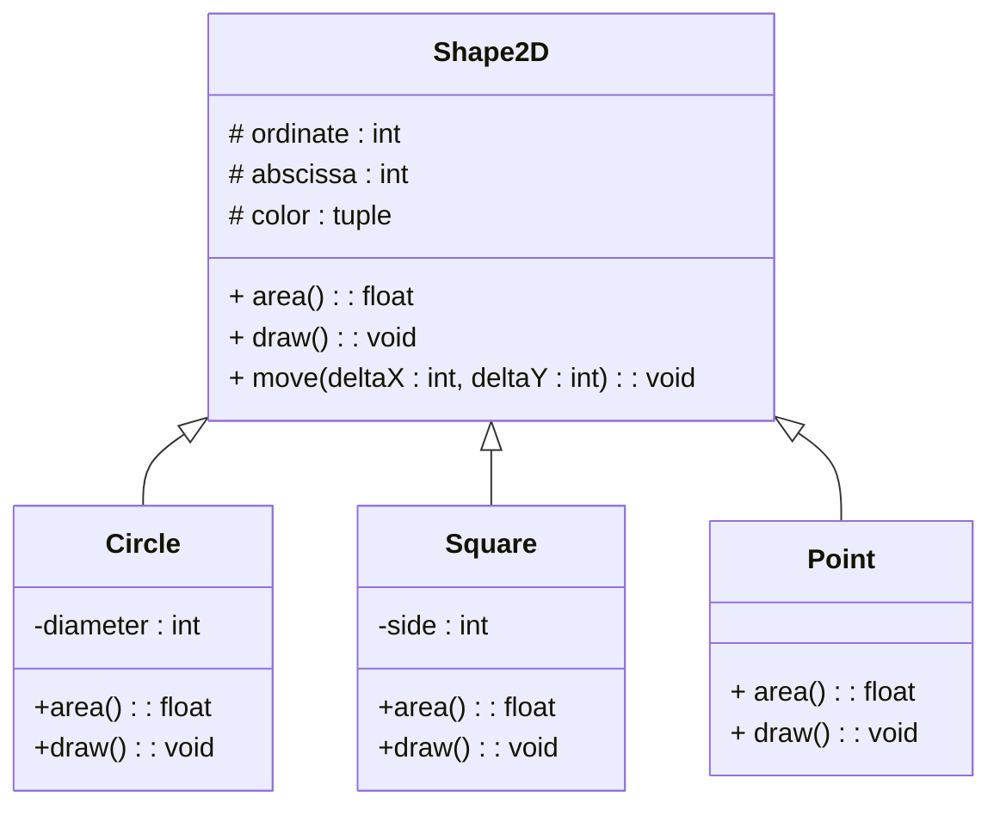

# TP 3 : Programmation Orientée Objet - Polymorphisme

Dans ce TP, on s'intéresse au concept d'héritage et de polymorphisme. Pour cela, on cherchera à développer un logiciel permettant de créer et d'afficher des figures géométriques plus ou moins complexes. Les compétences travaillées durant cette activité sont les suivantes : 

- Comprendre et décrire des interfaces logicielles
- Comprendre et utiliser l'héritage
- Comprendre et utiliser le polymorphisme

## Partie I : Comprendre UML (20 min)

**Figure 1 (ci-dessous) :** Diagramme de classes représentant des formes 2D.



Etant donné le diagramme de classes ci-dessus représentant des formes 2D, répondre aux questions suivantes :
1. L'attribut **diameter** est-il accessible pour un objet **Square** ?
1. Un objet **Circle** possède-t-il un attribut **color** 
1. Peut-on appliquer la méthode **move** à un objet **Point** ?
1. Grâce à quelle notion de l'approche objet, la méthode **rotate** peut-elle être présente dans toutes les classes du diagramme et à quoi sert cette notion ?
1. a. Quelle hypothèse doit-on considérer pour rendre la classe **Shape2D** abstraite ?
    
    b. Quel est l'intérêt d'éviter que cette surclasse soit concrète ?
    
    c. Quelle modification doit-on apporté au diagramme de classes ?


## Partie II : Classes et instances (1h00)

1. Traduire les classes ci-dessus en python. On veillera à ce que les points suivants soient respectés:
    - Une classe = un fichier.
    - Le programme lève une exception lorsque la couleur est invalide
        
        | Une couleur est valide si son type est un 3-uplet dont les valeurs sont comprises entre 0 et 255.

    - Les constructeurs sont correctement implémentés.
    - Les attributs sont tous privés ou protégés.
    - Les méthodes `area` et `move` sont correctement implémentés.
    - La méthode `draw` lève une exception de type `NotImplementedError` car elle sera implémentée plus tard dans le TP. 
    - Les types sont déclarés selon la norme PEP 483.
    - Le code est documenté.

1. Proposer une extension du modèle UML (figure 1) permettant d'obtenir une forme 2D composé de plusieurs autres formes 2D. 

1. Traduire cette extension en python.

## Partie III : Affichage des formes sur un écran collaboratif


## Partie IV : Sauvegarde dans une base de données


<!-- 

   La relation entre entre `Figure` et `Square` est une relation d'héritage. `Square` hérite des attributs et méthodes `Figure`.
   ```python
   class Fille(Mere):
      pass
   ```

   La relation entre entre `Square` et `Point` est une relation composition. Un carré est composé de plusieurs points. -->

