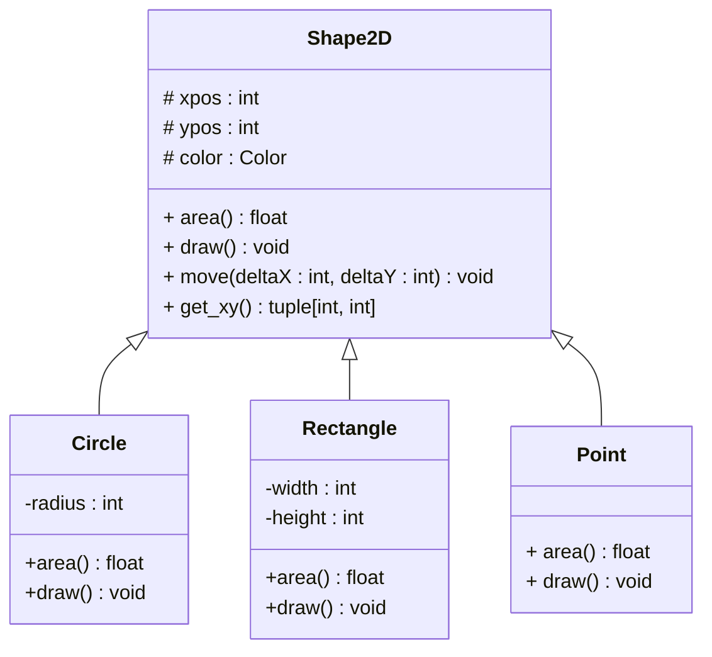

# TP 4 : Héritage et Polymorphisme

Dans ce TP, on s'intéresse au concept d'héritage et de polymorphisme. Pour cela, on cherchera à développer un logiciel permettant de créer et d'afficher des figures géométriques plus ou moins complexes via divers afficheurs graphiques. Les compétences travaillées durant cette activité sont les suivantes :

- Comprendre et décrire des interfaces logicielles
- Comprendre et utiliser l'héritage
- Comprendre et utiliser le polymorphisme

## Partie I : Comprendre UML

20 min

**Figure 1 (ci-dessous) :** Diagramme de classes représentant des formes 2D.



Etant donné le diagramme de classes ci-dessus représentant des formes 2D, répondre aux questions suivantes :

1. L'attribut **radius** est-il accessible pour un objet **Rectangle** ?
1. Un objet **Circle** possède-t-il un attribut **color**
1. Peut-on appliquer la méthode **move** à un objet **Point** ?
1. Grâce à quelle notion de l'approche objet, la méthode **area** peut-elle être présente dans toutes les classes du diagramme et à quoi sert cette notion ?
1. a. Quelle hypothèse doit-on considérer pour rendre la classe **Shape2D** abstraite ?

   b. Quel est l'intérêt d'éviter que cette surclasse soit concrète ?

   c. Quelle modification doit-on apporté au diagramme de classes ?

## Partie II : Classes et instances

1h30

**Formes simples**

1. Créer un environnement virtuel et l'activer.

1. Traduire les classes ci-dessus en python. On veillera à ce que les points suivants soient respectés:

   - Une classe = un fichier.
   - Les constructeurs sont correctement implémentés.
   - Le programme lève une exception lorsque la couleur est invalide

     ```python
     # Exemple de fonction qui lève une exception
     def function_with_error():
        raise Exception()
     ```

     **_Note :_** Une couleur est valide si son type est un 3-uplet dont les valeurs sont comprises entre 0 et 255. On pourra définir le type `Color` un alias vers le 3-uplets (**tuple** en anglais) d'entiers

   - Les méthodes `area`, `move` et `get_xy` sont correctement implémentés.
   - La méthode `draw` lève une exception de type `NotImplementedError` car elle sera implémentée plus tard dans le TP (voir exemple ci-dessous).

   <!-- - Les types sont déclarés selon la norme PEP 483. -->

1. Faire en sorte que l'appel du constructeur par défaut de la classe `Circle` renvoie une instance de cercle de rayon 10 en position x=0 et y=0.

1. Dans le fichier `partieII.py`, implémenter la fonction `run_question_4`. Cette fonction:

   - utilise le constructeur par défaut pour créer un cercle
   - affiche son aire
   - crée un rectangle de longueur 30 et de largeur 10 en position (10, 10)
   - le déplace en positon (15, 20)
   - affiche ses coordonnées x, y

   Tester la fonction en lançant le script `python3 partieII.py q4`.

**Formes composées**

5. Proposer une extension du modèle UML (figure 1) permettant d'obtenir une forme 2D composée de plusieurs autres formes 2D.

1. Traduire cette extension en python. On considère que l'aire de la forme 2D composée est la somme des aires des formes 2D individuelles. On pourra nommer notre forme composée `CombinedShape2D`.

1. Dans le fichier `partieII.py`, implémenter la fonction `run_question_6` permettant de:

   - construire une forme 2D composée de deux cercles et d'un rectangle au choix
   - afficher l'aire de cette forme
   - afficher les coordonnées de cette forme
   - appliquer une translation de 20 pixels en x et 8 pixels en y

   Tester la fonction en lançant le script `python3 partieII.py q6`.

## Partie III : Afficheur de formes

1h30

Dans cette partie on s'intéresse à l'affichage de formes géométriques.

**Affichage dans le terminal**

1. Créer l'interface python `Displayer` respectant les spécifications ci-dessous.

   ```mermaid
   classDiagram
       direction TB
        class Displayer {
           + draw_point(x: int, y: int, color: Color) void
           + draw_line(x1: int, y1: int, x2: int, y2: int, color: Color) void
           + draw_circle(x: int, y: int, radius: int, color: Color) void
           + draw_rectangle(x: int, y: int, width: int, length: int, color: Color) void
           + draw_square(x: int, y: int, side: int, color: Color) void
           }

       <<interface>> Displayer
   ```

1. Créer la classe `ShellDisplayer` qui implémente l'interface `Displayer` et affiche dans le terminal des messages de la forme:

   `FormeName(x=X, y=Y, attr1=ATTR1, attr2=ATTR2, ..., attrN=ATTRN, color=(R, G, B))`

   _Exemple :_  
   `Circle(x=10, y=5, radius=20, color=(0, 0, 255))`

1. Modifier la méthode `draw` de l'interface `Shape2D` pour quelle accepte en paramètre un afficheur quelconque.

1. Implémenter les méthodes `draw` des classes `Point`, `Line`, `Circle`, `Rectangle`, `Square` et `CombinedShape2D`.

1. Dans le fichier `partieIIII.py`, compléter la fonction `run_question_5`. Tester.

1. Créer une classe `Smiley` qui est une forme composée de **3 cercles** (1 pour le visage et 2 pour les yeux), **un carré** pour le nez et **un rectangle** pour la bouche.

   On fera attention à ce que l'utilisation suivante soit valide.

   ```python
   displayer = ShellDisplayer()
   smiley = Smiley(x=100, y=50, size=45, color=(20, 20, 20))
   smiley.draw(displayer)
   ```

   Exécuter la commande `python3 partieIIII.py q6` pour vérifer.

**Affichage partagé**

On souhaite désormais afficher nos formes sur un écran partagé sur le web. Le site [draw.david-albert.fr](http://draw.david-albert.fr) est un tableau interactif un peu particulier. Pour y dessiner une forme il faut utiliser une requête HTTP de type POST.

    La documentation de l'API du tableau interactif est donné dans le fichier DOC.md.

7. Installer la bibliothèque `requests` qui permet d'exécuter des requêtes HTTP.

1. Créer une classe `WebDisplayer` qui implémente l'interface `Displayer` dans le but d'afficher des formes géométriques sur le tableau interactif.

1. Dans le ficher `partieIII.py`, implémenter la fonction `run_question_9`. Le programme demande à l'utilisateur d'indiquer le numéro de l'écran d'affichage puis, en continue, lui demande trois 3 valeurs (x, y et size) et affiche le smiley correspondant. Dès que l'utilisateur entre la chaîne `"q"`, le programme s'arrête.

   Tester `python3 partieIII.py q9`

1. Améliorer l'affichage de votre bonhomme et prenez une capture d'écran (à joindre dans le dossier de restitution).

## Partie IV : Sauvegarde de formes dans un fichier

30 min

Modifier l'architecture du logiciel actuel pour faire en sorte que l'on puisse sauvegarder une forme 2D quelconque dans un fichier JSON. On fera également en sorte de pouvoir reconstruire une forme depuis un fichier précédemment créé.

**Aide :** Un dictionnaire python peut être simplement transcrit au format JSON en utilisant la fonction [dumps](https://www.geeksforgeeks.org/how-to-convert-python-dictionary-to-json/) du module [json](https://www.geeksforgeeks.org/how-to-convert-python-dictionary-to-json/).

<!-- ## Partie V : Pictionary

Dans cette dernière partie on se propose de développer une version un peu particulière du jeu pictionary.

Le déroulement du jeu est le suivant:

- Deux joueurs jouent de façon collaborative
- Le premier joueur pense à 1 objet (par exemple: une voiture, un arbre et une limace)
- Il crée à la main un fichier JSON dans lesquels il tente de décrire les objets imaginés (dans format de la partie III). On pourra nommer le fichier du joueur 1 `objet-j1.json`.
- Au lancement du programme `pictionary`, le programme demande l'identifiant d'un afficheur partagé puis:
  - charge l'objet dans une forme 2D multiple
  - affiche la première sous-forme de l'objet pendant 5 secondes
  - au terme de ces 5 secondes le second joueur peut, dans le terminal, écrire le nom de l'objet qu'il pense que le joueur 1 a voulu dessiner
  - le programme compare l'entrée du joueur 2 au résultat et:
    1. s'il a bon, le joueur gagne `10 - n` points, où `n` est le nombre de tour mis pour trouver la réponse.
    2. sinon le programme affiche les 2 premières sous formes pendant 5 secondes puis laisse le joueur 1 faire une seconde proposition. S'il trouve il gagnera donc `10 - 2 = 8 points`. Sinon, o le programme affichera les 3 premières sous formes pendant 5 secondes et ainsi de suite jusqu'à `n=10` répétitions. -->

<!-- ## Déjà terminé ?

Vous pouvez dès à présent commencer [le TP n°4 sur la conception logicielle avec UML](../TP5-UML/README.md). -->
