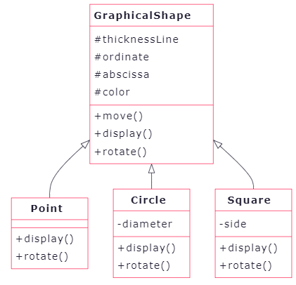
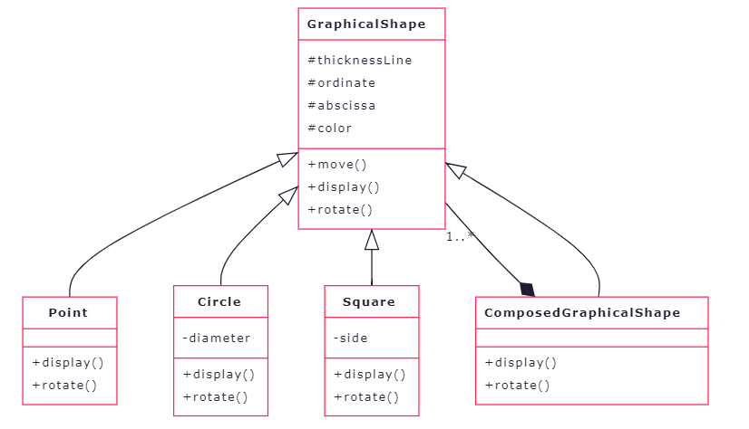
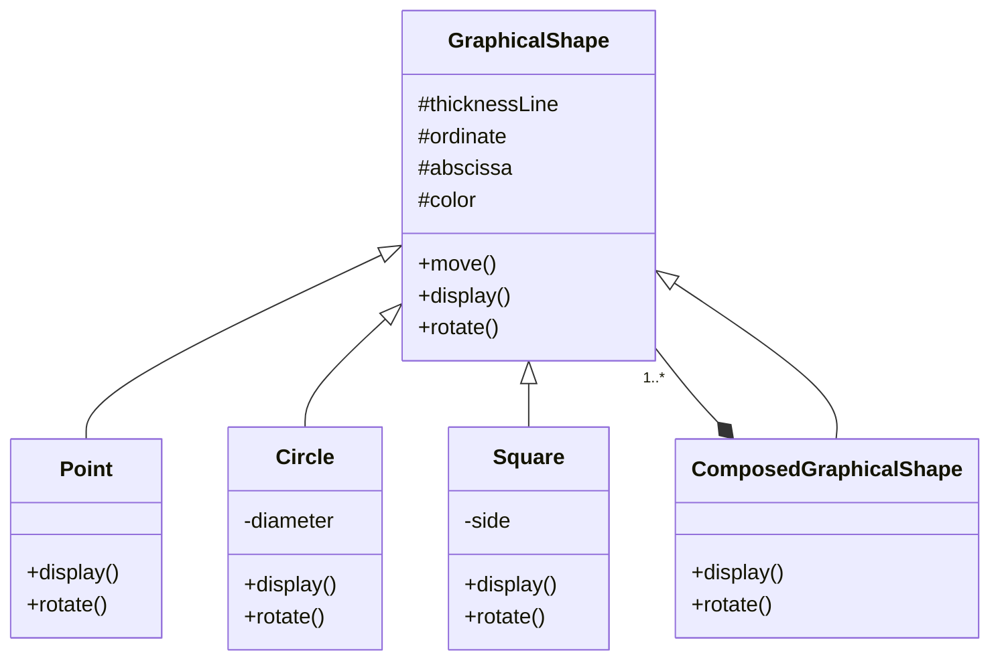
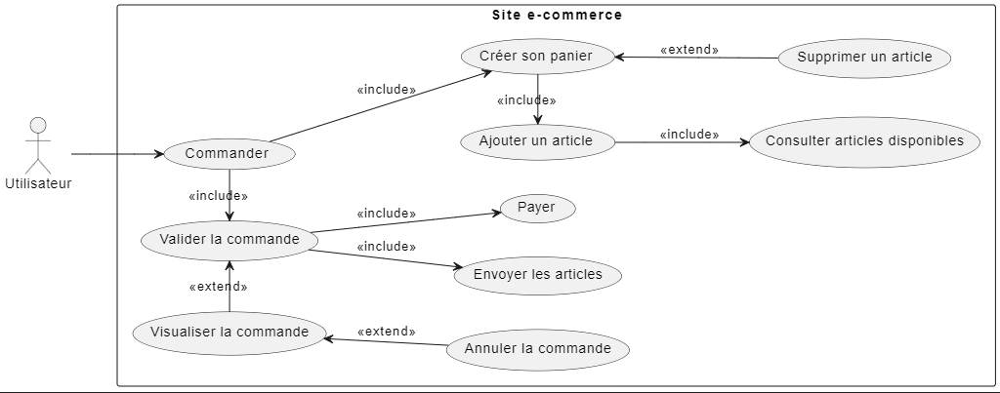
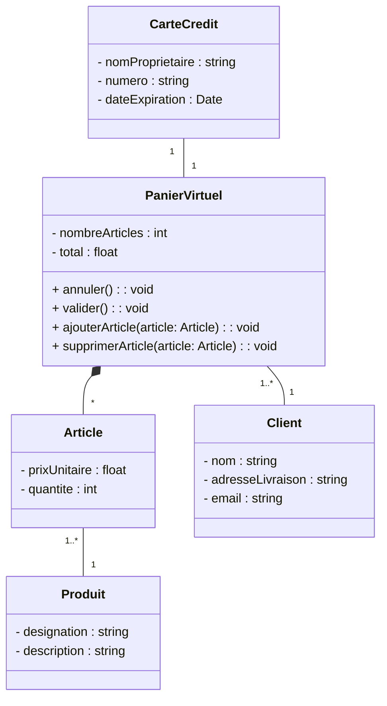
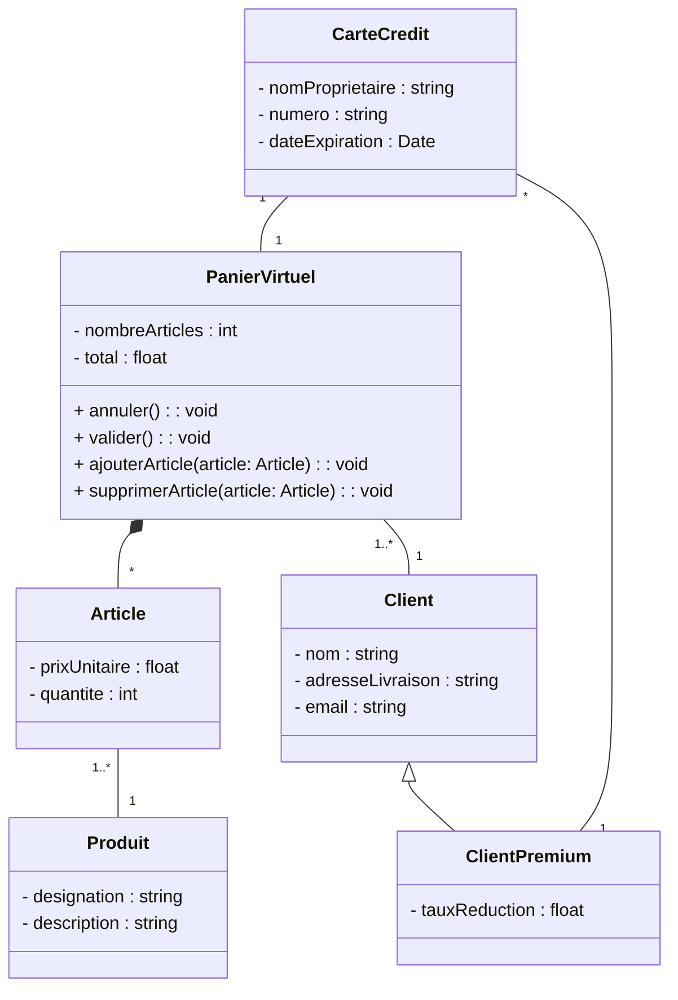

# TP 5 : UML

Dans ce TP, on s'intéresse à la conception de logiciels en utilisant la modélisation UML.

Les compétences travaillées durant cette activité sont les suivantes :

- Comprendre une description textuel d'un système logiciel
- Comprendre une description UML d'un système logiciel
- Décrire un système logiciel dans ses premières phases de conception

En particulier:

- Comprendre et réaliser un **diagramme de cas d'utilisation**
- Comprendre et réaliser un **modèle du domaine**
- Comprendre et réaliser un **diagramme de classe participantes**
- Comprendre et réaliser un **diagramme de séquences**

## (TP4) Partie I : Comprendre UML

30 min



Etant donné le diagramme de classes ci-dessus représentant des objets graphiques, répondre aux questions suivantes :

1. L'attribut **diameter** est-il accessible pour un objet **Square** ?

   **Non**

1. Un objet **Circle** possède-t-il un attribut **color**

   **Oui** car héritée de la classe **GraphicalShape**

1. Peut-on appliquer la méthode **move** à un objet **Point** ?

   **Oui** car héritée de la classe **GraphicalShape**

1. Grâce à quelle notion de l'approche objet, la méthode **rotate** peut-elle être présente dans toutes les classes du diagramme et à quoi sert cette notion ?

   La méthode **rotate** est présente dans toutes les classes du diagramme et y possède un comportement différent grâce à la notion de **polymorphisme**.

1. a. Quelle hypothèse doit-on considérer pour rendre la classe **GraphicalShape** abstraite ?

   Une classe abstraite ne peut pas possédé d'instances directes. Pour que **GraphicalShape** soit abstraite, il faut considéré qu'elle ne décrit que partiellement les formes graphiques. Pour cela, on rend les méthodes **display** et **rotate** abstraites. En effet, il n'est pas possible de dessiner ou de pivoter une forme sans connaître sa nature.

   b. Quel est l'intérêt d'éviter que cette surclasse soit concrète ?

   L'intérêt que cette surclasse ne soit pas concrète est d'éviter de devoir spécifier le comportement des méthodes **display** et **rotate** (qui n'a pas de sens pour une forme inconnue).

   c. Quelle modification doit-on apporté au diagramme de classes ?

   En UML, on spécifie qu'une classe est abstraite en l'écrivant en _italic_ ou en écrivant _\<\<abstract\>\>_ au dessus de son nom.
   Les méthodes **display** et **rotate** seront également écrites en _italic_ ou alors en <u>soulignant</u>.

1. Proposez une extension du modèle permettant d'obtenir un objet graphique composé de plusieurs autres objets graphiques.

<!--  -->



## (TP5) Partie I : Classes et relations

30 min

1. Représenter une classe décrivant des livres électroniques. Les informations spécifiques à chaque livre sont : son titre, son nombre de page et le nom de l'auteur. Les actions possibles sont d'aller à la page suivante ou d'aller à la page précédente.

   ```mermaid
   classDiagram
   direction TB
       class ElectronicBook {
           - title : string
           - nbPages : int
           - author : string

           + nextPage() : void
           + previousPage() : void
       }
   ```

1. Décriver en UML un diagramme de classes illustrant la description suivante : une personne possède un ou plusieurs livres électronique.

   ```mermaid
   classDiagram
   direction LR
       Person --> "1..*" ElectronicBook : possède
   ```

1. Décriver en UML un diagramme de classes illustrant la description suivante : les disquettes, les clés USB et les disques durs sont des périphériques de stockage.

   ```mermaid
   classDiagram
   direction TB
       StorageDevice <|-- Diskettes
       StorageDevice <|-- UsbStick
       StorageDevice <|-- HardDisk
   ```

1. Un message électronique comporte un titre ainsi que l'adresse du destinataire. Il est composé d'un en-tête et d'un corps. Il peut contenir éventuellement une ou plusieurs pièces jointes. Tracez le diagramme de classes correspondant à cette description.

   ```mermaid
   classDiagram
           class EMail {
               - title : string
               - destinataire : string
           }

           EMail *-- Header
           EMail *-- Body
           EMail o-- "*" Attachment
   ```

## (TP5) Partie II : Site de e-commerce

1 h 00

Voici la description d'un système de commerce électronique :

- Un utilisateur (client) qui se connecte à un site de commerce électronique choisit parmi les produits proposés.
- Il remplit au fur et à mesure un panier virtuel comportant les produits à acheter.
- A tout moment, il peut ajouter ou supprimer un produit au panier.
- Le paiement s'effectue à l'aide d'une carte de crédit. Celle-ci n'appartient pas nécessairement à l'utilisateur.
- A la fin de la transaction, l'utilisateur peut soit valider sa commande ou l'annuler.

**1.** Décrivez le système à l'aide d'un diagramme de cas d'utilisation.



**2.** Décrivez le système à l'aide d'un diagramme de classes.



**3.** Complétez le diagramme en ajoutant le concept de client premium. Ce type de clients bénéficie d'une réduction pour ses achats et les informations de ses cartes de crédit sont sauvegardées par le système.



**4.** Décrivez le système à l'aide d'un diagramme de séquences.

## (TP5) Partie III :

L'école GEMA a besoin de connaître les moyennes pour ses 3 filières (IASchool, CyberManagement et ...) pour toutes les matières et pour tous les étudiants.

On suppose que les filières ont le même nombre de matières.

1. Identifier les classes et décrire le diagramme de classe
2. Etablir un scénario pour effectuer la moyennes de GEMA

## (TP5) Partie III : Donner le diagramme UML correspondant au système logiciel du TP 3

<!-- ## (TP5) Partie V: Emprunt d'un livre dans une bibliothèque

On considère la procédure d'emprunt d'un livre dans une bibliothèque par un adhérent connaissant le titre de l'ouvrage :

"L'adhérent présente sa carte d'abonné au préposé qui enregistre son passage. L'adhérent indique le titre du livre souhaité. Le préposé effectue une recherche automatique dans sa base pour vérifier l'existence et la disponibilité de l'ouvrage". Lorque la réponse est positive, il demande confirmation à l'adhérent. Celui-ci confirme. Le préposé va alors chercher le livre en tenant compte de sa localisation et le remet à l'adhérent. Le préposé valide l'emprunt et valide la carte mégnétique l'adhérent. Celui-ci récupère le livre et sa carte puis sort de la bibliothèque après avoir présenté l'ouvrage et la carte à un lecteur magnétique qui ouvre le portillon après vérification et retourne la carte et le livre.

1. Identifier les divers scénarios et les événements les déclenchant
2. Reformuler le texte en utilisant des diagrammes d'envoi de messages entre les objets de votre choix. Préciser les classes nécessaires et donner leur spécifications. -->
